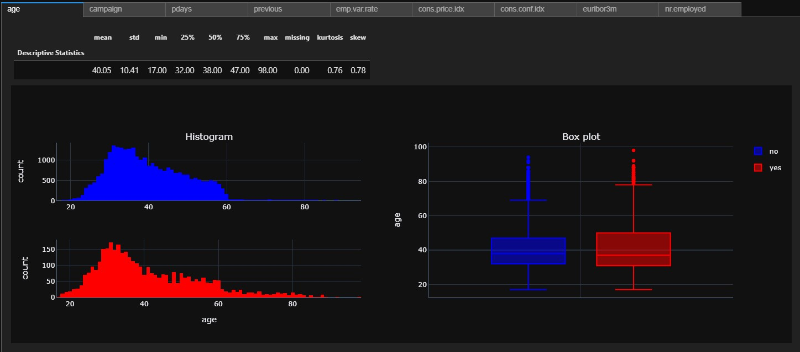
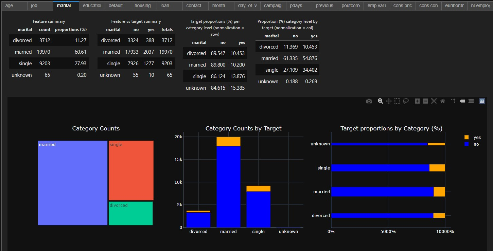
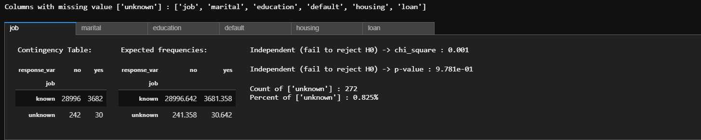

# Bank-Marketing

The data is related with direct marketing campaigns (phone calls) of a Portuguese banking institution. The classification goal is to predict if the client will subscribe a term deposit (variable y). The data was downloaded from https://archive.ics.uci.edu/ml/datasets/Bank+Marketing.

Click in the link below to go to the interactive notebook

This project is divided into two parts: [part I](./Bank-Marketing-Part-I-EDA.ipynb) deals with intense EDA of the dataset, using ipywidgets and plotly. 

### Some Examples:
#### Numeric Features vs Response Summary

#### Categorical Features vs Response Summary

#### Chi-square test for missing values imputation

